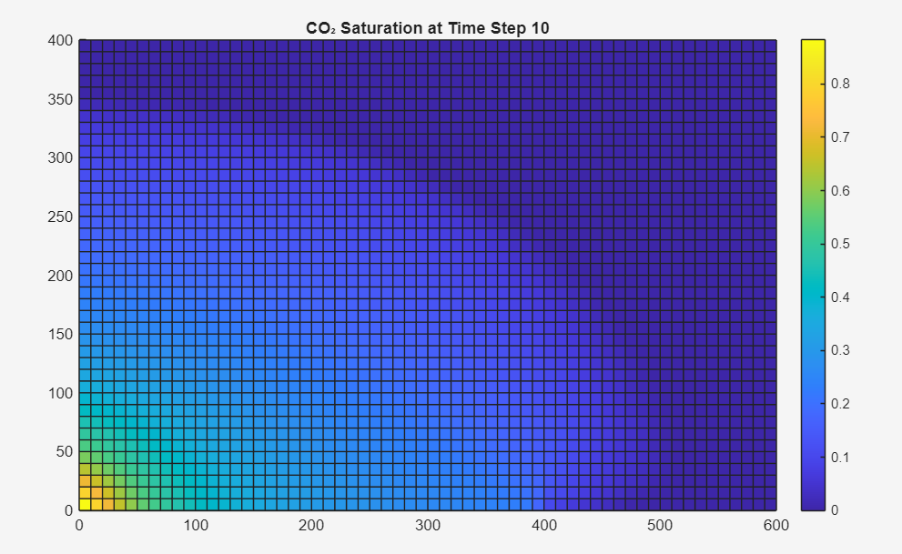

# CO₂ Injection Simulation – Synthetic Reservoir 

This project simulates **CO₂ injection into a 2D synthetic saline aquifer** using the MATLAB Reservoir Simulation Toolbox (MRST). It visualises the movement of the CO₂ plume over time and forms the foundation for enhanced oil recovery (EOR) and carbon storage studies.

---

##  Objective

To model and visualise the dynamic behaviour of injected CO₂ in a homogeneous reservoir environment, and build transferable knowledge in:
- Numerical reservoir simulation
- Subsurface flow visualisation
- Plume migration monitoring (for CCS or EOR)

---

##  Tools and Framework

- **MRST Version**: 2025a
- **Modules Used**:  
  `ad-core`, `ad-blackoil`, `mrst-gui`
- **Simulation Engine**: Autodiff-based (`simulateScheduleAD`)
- **Language**: MATLAB

---

##  Model Setup

| Parameter        | Value                  |
|------------------|------------------------|
| Grid             | 60 × 40 cells (600 × 400 m) |
| Cell Size        | 10 × 10 m              |
| Porosity         | 0.20                   |
| Permeability     | 100 mD                 |
| Initial Pressure | 100 bars               |
| Initial Saturation | 100% brine (water)   |

---

##  Fluids

| Phase | Viscosity (cP) | Density (kg/m³) |
|-------|----------------|-----------------|
| Water | 1              | 1000            |
| CO₂   | 0.06           | 700             |

---

##  Well Configuration

- **Injector**: Top-left corner of grid  
  - Type: Rate-controlled  
  - Injection rate: 100 m³/day  
  - Composition: 100% CO₂  
- **Producer**: Bottom-right corner  
  - Type: BHP-controlled  
  - Pressure: 50 bars  
  - Composition: 100% brine

---

##  Simulation Details

- Total time: 100 days  
- Number of steps: 10 (10 days each)  
- Model: `ThreePhaseBlackOilModel`

```matlab
fluid = initSimpleADIFluid('phases', 'WG', ...
    'mu', [1, 0.06]*centi*poise, ...
    'rho', [1000, 700], ...
    'n', [2, 2]);

state0 = initResSol(G, 100*barsa, [1, 0]);  % 100% brine saturation
```

---

##  Result – Time Step 10

At time step 10, the CO₂ plume had visibly migrated from the injector toward the producer.



---

##  How to Run

1. Ensure MRST is installed, and run:
   ```matlab
   mrstModule add ad-core ad-blackoil mrst-gui
   ```
2. Open and run `co2_injection_simulation.m`
3. View saturation plots evolve over time

---

##  Key Takeaways

- How fluid properties impact plume migration  
- CO₂ front propagation in a simple homogeneous reservoir  
- Saturation visualisation using `plotCellData()`  
- Fundamental workflow for CCS and gas injection studies

---

##  Note
This project was developed to build practical skills in reservoir simulation using MRST and to contribute to the understanding of CO₂ behaviour in subsurface systems. It also forms the base case for future work, including:

- Water + CO₂ co-injection (WAG-style simulation)  
- Heterogeneous grid design  
- Recovery factor tracking and economic analysis
